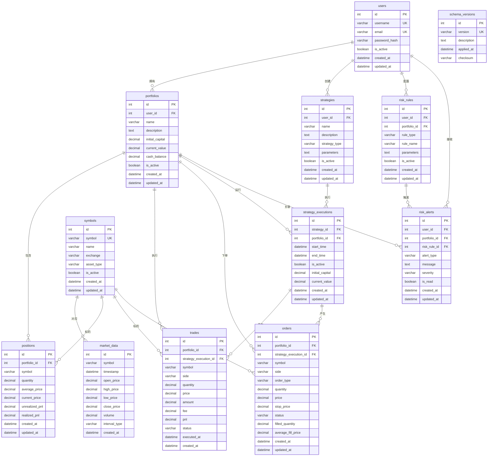

# 量化交易系统数据库ER图

## Mermaid ER图代码

## 关系说明

### 一对多关系
1. **用户 → 投资组合**: 一个用户可以拥有多个投资组合
2. **用户 → 策略**: 一个用户可以创建多个交易策略
3. **用户 → 风险规则**: 一个用户可以配置多个风险规则
4. **用户 → 风险警报**: 一个用户可以接收多个风险警报
5. **投资组合 → 持仓**: 一个投资组合可以包含多个持仓
6. **投资组合 → 交易**: 一个投资组合可以执行多个交易
7. **投资组合 → 订单**: 一个投资组合可以下多个订单
8. **投资组合 → 策略执行**: 一个投资组合可以运行多个策略执行
9. **策略 → 策略执行**: 一个策略可以有多个执行实例
10. **策略执行 → 交易**: 一个策略执行可以产生多个交易
11. **策略执行 → 订单**: 一个策略执行可以产生多个订单
12. **风险规则 → 风险警报**: 一个风险规则可以触发多个警报
13. **标的 → 市场数据**: 一个标的有多个市场数据记录
14. **标的 → 持仓**: 一个标的可以在多个持仓中
15. **标的 → 交易**: 一个标的可以有多个交易记录
16. **标的 → 订单**: 一个标的可以有多个订单

### 多对一关系
1. **投资组合 → 用户**: 多个投资组合属于一个用户
2. **持仓 → 投资组合**: 多个持仓属于一个投资组合
3. **交易 → 投资组合**: 多个交易属于一个投资组合
4. **交易 → 策略执行**: 多个交易可以属于一个策略执行
5. **订单 → 投资组合**: 多个订单属于一个投资组合
6. **订单 → 策略执行**: 多个订单可以属于一个策略执行
7. **策略 → 用户**: 多个策略属于一个用户
8. **策略执行 → 策略**: 多个策略执行属于一个策略
9. **策略执行 → 投资组合**: 多个策略执行属于一个投资组合
10. **风险规则 → 用户**: 多个风险规则属于一个用户
11. **风险规则 → 投资组合**: 多个风险规则可以属于一个投资组合
12. **风险警报 → 用户**: 多个风险警报属于一个用户
13. **风险警报 → 投资组合**: 多个风险警报可以属于一个投资组合
14. **风险警报 → 风险规则**: 多个风险警报可以属于一个风险规则

## 关键约束

### 唯一性约束
- `users.username` - 用户名唯一
- `users.email` - 邮箱唯一
- `symbols.symbol` - 标的代码唯一
- `portfolios.portfolio_id + symbol` - 投资组合内标的唯一
- `market_data.symbol + timestamp + interval_type` - 市场数据唯一
- `schema_versions.version` - 版本号唯一

### 外键约束
- 所有FK字段都有对应的外键约束
- 大部分外键使用CASCADE删除
- 部分外键使用SET NULL（如strategy_execution_id）

### 业务约束
- 交易方向只能是'buy'或'sell'
- 订单类型只能是'market'、'limit'或'stop'
- 资产类型只能是'stock'、'crypto'或'forex'
- 时间间隔只能是'1m'、'5m'、'15m'、'1h'或'1d'
- 警报严重程度只能是'low'、'medium'、'high'或'critical'

---

此ER图展示了量化交易系统数据库的完整关系结构，便于理解各表之间的关联关系。
