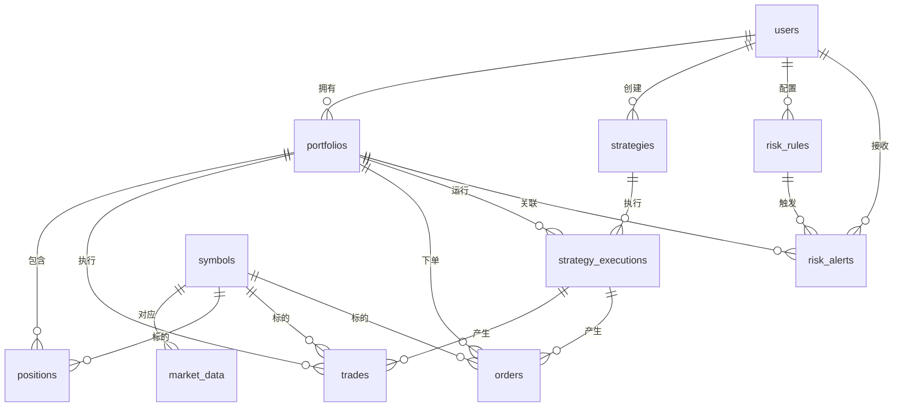

# 量化交易系统数据库模型设计文档

## 文档信息
- **版本**: v1.0.0
- **创建时间**: 2024-12-19
- **数据库类型**: MySQL 8.0+
- **字符集**: utf8mb4
- **时区**: UTC+0

## 概述

本文档详细描述了量化交易系统的数据库模型设计，包含8个核心业务模块，共12张表。系统采用关系型数据库设计，支持多用户、多投资组合、多策略的量化交易管理。

## 系统架构

```
用户管理 → 投资组合管理 → 交易管理 → 策略管理
    ↓           ↓           ↓         ↓
风险管理 ← 市场数据管理 ← 订单管理 ← 策略执行
```

## 表结构详细说明

### 1. 用户管理模块

#### 1.1 用户表 (users)

**表说明**: 存储系统用户的基本信息

| 字段名 | 数据类型 | 长度 | 是否为空 | 默认值 | 说明 |
|--------|----------|------|----------|--------|------|
| id | INT | - | NOT NULL | AUTO_INCREMENT | 用户ID，主键 |
| username | VARCHAR | 80 | NOT NULL | - | 用户名，唯一 |
| email | VARCHAR | 120 | NOT NULL | - | 邮箱地址，唯一 |
| password_hash | VARCHAR | 255 | NOT NULL | - | 密码哈希值 |
| is_active | BOOLEAN | - | NULL | TRUE | 是否激活 |
| created_at | DATETIME | - | NULL | CURRENT_TIMESTAMP | 创建时间 |
| updated_at | DATETIME | - | NULL | CURRENT_TIMESTAMP ON UPDATE | 更新时间 |

**索引**:
- PRIMARY KEY (`id`)
- UNIQUE KEY `uk_username` (`username`)
- UNIQUE KEY `uk_email` (`email`)
- INDEX `idx_created_at` (`created_at`)

**关联关系**:
- 一对多关联到 `portfolios` 表
- 一对多关联到 `strategies` 表
- 一对多关联到 `risk_rules` 表

### 2. 投资组合管理模块

#### 2.1 投资组合表 (portfolios)

**表说明**: 存储用户的投资组合信息

| 字段名 | 数据类型 | 长度 | 是否为空 | 默认值 | 说明 |
|--------|----------|------|----------|--------|------|
| id | INT | - | NOT NULL | AUTO_INCREMENT | 投资组合ID，主键 |
| user_id | INT | - | NOT NULL | - | 用户ID，外键 |
| name | VARCHAR | 100 | NOT NULL | - | 投资组合名称 |
| description | TEXT | - | NULL | - | 描述信息 |
| initial_capital | DECIMAL | 15,2 | NOT NULL | 0.00 | 初始资金 |
| current_value | DECIMAL | 15,2 | NOT NULL | 0.00 | 当前价值 |
| cash_balance | DECIMAL | 15,2 | NOT NULL | 0.00 | 现金余额 |
| is_active | BOOLEAN | - | NULL | TRUE | 是否激活 |
| created_at | DATETIME | - | NULL | CURRENT_TIMESTAMP | 创建时间 |
| updated_at | DATETIME | - | NULL | CURRENT_TIMESTAMP ON UPDATE | 更新时间 |

**索引**:
- PRIMARY KEY (`id`)
- FOREIGN KEY (`user_id`) REFERENCES `users`(`id`) ON DELETE CASCADE
- INDEX `idx_user_id` (`user_id`)
- INDEX `idx_name` (`name`)

**关联关系**:
- 多对一关联到 `users` 表
- 一对多关联到 `positions` 表
- 一对多关联到 `trades` 表
- 一对多关联到 `strategy_executions` 表

#### 2.2 持仓表 (positions)

**表说明**: 存储投资组合中的持仓信息

| 字段名 | 数据类型 | 长度 | 是否为空 | 默认值 | 说明 |
|--------|----------|------|----------|--------|------|
| id | INT | - | NOT NULL | AUTO_INCREMENT | 持仓ID，主键 |
| portfolio_id | INT | - | NOT NULL | - | 投资组合ID，外键 |
| symbol | VARCHAR | 20 | NOT NULL | - | 标的代码 |
| quantity | DECIMAL | 15,8 | NOT NULL | 0.00000000 | 持仓数量 |
| average_price | DECIMAL | 15,8 | NOT NULL | 0.00000000 | 平均价格 |
| current_price | DECIMAL | 15,8 | NOT NULL | 0.00000000 | 当前价格 |
| unrealized_pnl | DECIMAL | 15,2 | NOT NULL | 0.00 | 未实现盈亏 |
| realized_pnl | DECIMAL | 15,2 | NOT NULL | 0.00 | 已实现盈亏 |
| created_at | DATETIME | - | NULL | CURRENT_TIMESTAMP | 创建时间 |
| updated_at | DATETIME | - | NULL | CURRENT_TIMESTAMP ON UPDATE | 更新时间 |

**索引**:
- PRIMARY KEY (`id`)
- FOREIGN KEY (`portfolio_id`) REFERENCES `portfolios`(`id`) ON DELETE CASCADE
- UNIQUE KEY `uk_portfolio_symbol` (`portfolio_id`, `symbol`)
- INDEX `idx_symbol` (`symbol`)

**关联关系**:
- 多对一关联到 `portfolios` 表

### 3. 交易管理模块

#### 3.1 交易记录表 (trades)

**表说明**: 存储所有已执行的交易记录

| 字段名 | 数据类型 | 长度 | 是否为空 | 默认值 | 说明 |
|--------|----------|------|----------|--------|------|
| id | INT | - | NOT NULL | AUTO_INCREMENT | 交易ID，主键 |
| portfolio_id | INT | - | NOT NULL | - | 投资组合ID，外键 |
| strategy_execution_id | INT | - | NULL | - | 策略执行ID，外键 |
| symbol | VARCHAR | 20 | NOT NULL | - | 标的代码 |
| side | VARCHAR | 10 | NOT NULL | - | 交易方向(buy/sell) |
| quantity | DECIMAL | 15,8 | NOT NULL | - | 交易数量 |
| price | DECIMAL | 15,8 | NOT NULL | - | 交易价格 |
| amount | DECIMAL | 15,2 | NOT NULL | - | 交易金额 |
| fee | DECIMAL | 15,2 | NOT NULL | 0.00 | 手续费 |
| pnl | DECIMAL | 15,2 | NOT NULL | 0.00 | 盈亏 |
| status | VARCHAR | 20 | NOT NULL | 'completed' | 状态(pending/completed/cancelled) |
| executed_at | DATETIME | - | NOT NULL | CURRENT_TIMESTAMP | 执行时间 |
| created_at | DATETIME | - | NULL | CURRENT_TIMESTAMP | 创建时间 |

**索引**:
- PRIMARY KEY (`id`)
- FOREIGN KEY (`portfolio_id`) REFERENCES `portfolios`(`id`) ON DELETE CASCADE
- FOREIGN KEY (`strategy_execution_id`) REFERENCES `strategy_executions`(`id`) ON DELETE SET NULL
- INDEX `idx_portfolio_id` (`portfolio_id`)
- INDEX `idx_symbol` (`symbol`)
- INDEX `idx_executed_at` (`executed_at`)

**关联关系**:
- 多对一关联到 `portfolios` 表
- 多对一关联到 `strategy_executions` 表

#### 3.2 订单表 (orders)

**表说明**: 存储交易订单信息

| 字段名 | 数据类型 | 长度 | 是否为空 | 默认值 | 说明 |
|--------|----------|------|----------|--------|------|
| id | INT | - | NOT NULL | AUTO_INCREMENT | 订单ID，主键 |
| portfolio_id | INT | - | NOT NULL | - | 投资组合ID，外键 |
| strategy_execution_id | INT | - | NULL | - | 策略执行ID，外键 |
| symbol | VARCHAR | 20 | NOT NULL | - | 标的代码 |
| side | VARCHAR | 10 | NOT NULL | - | 交易方向(buy/sell) |
| order_type | VARCHAR | 20 | NOT NULL | - | 订单类型(market/limit/stop) |
| quantity | DECIMAL | 15,8 | NOT NULL | - | 订单数量 |
| price | DECIMAL | 15,8 | NULL | - | 限价单价格 |
| stop_price | DECIMAL | 15,8 | NULL | - | 止损价格 |
| status | VARCHAR | 20 | NOT NULL | 'pending' | 状态(pending/filled/cancelled/rejected) |
| filled_quantity | DECIMAL | 15,8 | NOT NULL | 0.00000000 | 已成交数量 |
| average_fill_price | DECIMAL | 15,8 | NULL | - | 平均成交价 |
| created_at | DATETIME | - | NULL | CURRENT_TIMESTAMP | 创建时间 |
| updated_at | DATETIME | - | NULL | CURRENT_TIMESTAMP ON UPDATE | 更新时间 |

**索引**:
- PRIMARY KEY (`id`)
- FOREIGN KEY (`portfolio_id`) REFERENCES `portfolios`(`id`) ON DELETE CASCADE
- FOREIGN KEY (`strategy_execution_id`) REFERENCES `strategy_executions`(`id`) ON DELETE SET NULL
- INDEX `idx_portfolio_id` (`portfolio_id`)
- INDEX `idx_symbol` (`symbol`)
- INDEX `idx_status` (`status`)

**关联关系**:
- 多对一关联到 `portfolios` 表
- 多对一关联到 `strategy_executions` 表

### 4. 策略管理模块

#### 4.1 策略表 (strategies)

**表说明**: 存储交易策略配置信息

| 字段名 | 数据类型 | 长度 | 是否为空 | 默认值 | 说明 |
|--------|----------|------|----------|--------|------|
| id | INT | - | NOT NULL | AUTO_INCREMENT | 策略ID，主键 |
| user_id | INT | - | NOT NULL | - | 用户ID，外键 |
| name | VARCHAR | 100 | NOT NULL | - | 策略名称 |
| description | TEXT | - | NULL | - | 策略描述 |
| strategy_type | VARCHAR | 50 | NOT NULL | - | 策略类型 |
| parameters | TEXT | - | NULL | - | JSON格式的策略参数 |
| is_active | BOOLEAN | - | NULL | TRUE | 是否激活 |
| created_at | DATETIME | - | NULL | CURRENT_TIMESTAMP | 创建时间 |
| updated_at | DATETIME | - | NULL | CURRENT_TIMESTAMP ON UPDATE | 更新时间 |

**索引**:
- PRIMARY KEY (`id`)
- FOREIGN KEY (`user_id`) REFERENCES `users`(`id`) ON DELETE CASCADE
- INDEX `idx_user_id` (`user_id`)
- INDEX `idx_strategy_type` (`strategy_type`)

**关联关系**:
- 多对一关联到 `users` 表
- 一对多关联到 `strategy_executions` 表

#### 4.2 策略执行表 (strategy_executions)

**表说明**: 存储策略的执行实例信息

| 字段名 | 数据类型 | 长度 | 是否为空 | 默认值 | 说明 |
|--------|----------|------|----------|--------|------|
| id | INT | - | NOT NULL | AUTO_INCREMENT | 策略执行ID，主键 |
| strategy_id | INT | - | NOT NULL | - | 策略ID，外键 |
| portfolio_id | INT | - | NOT NULL | - | 投资组合ID，外键 |
| start_time | DATETIME | - | NOT NULL | - | 开始时间 |
| end_time | DATETIME | - | NULL | - | 结束时间 |
| is_active | BOOLEAN | - | NULL | TRUE | 是否激活 |
| initial_capital | DECIMAL | 15,2 | NOT NULL | - | 初始资金 |
| current_value | DECIMAL | 15,2 | NOT NULL | - | 当前价值 |
| created_at | DATETIME | - | NULL | CURRENT_TIMESTAMP | 创建时间 |
| updated_at | DATETIME | - | NULL | CURRENT_TIMESTAMP ON UPDATE | 更新时间 |

**索引**:
- PRIMARY KEY (`id`)
- FOREIGN KEY (`strategy_id`) REFERENCES `strategies`(`id`) ON DELETE CASCADE
- FOREIGN KEY (`portfolio_id`) REFERENCES `portfolios`(`id`) ON DELETE CASCADE
- INDEX `idx_strategy_id` (`strategy_id`)
- INDEX `idx_portfolio_id` (`portfolio_id`)

**关联关系**:
- 多对一关联到 `strategies` 表
- 多对一关联到 `portfolios` 表
- 一对多关联到 `trades` 表
- 一对多关联到 `orders` 表

### 5. 市场数据模块

#### 5.1 标的信息表 (symbols)

**表说明**: 存储交易标的基本信息

| 字段名 | 数据类型 | 长度 | 是否为空 | 默认值 | 说明 |
|--------|----------|------|----------|--------|------|
| id | INT | - | NOT NULL | AUTO_INCREMENT | 标的ID，主键 |
| symbol | VARCHAR | 20 | NOT NULL | - | 标的代码，唯一 |
| name | VARCHAR | 100 | NOT NULL | - | 标的名称 |
| exchange | VARCHAR | 50 | NULL | - | 交易所 |
| asset_type | VARCHAR | 20 | NOT NULL | - | 资产类型(stock/crypto/forex) |
| is_active | BOOLEAN | - | NULL | TRUE | 是否激活 |
| created_at | DATETIME | - | NULL | CURRENT_TIMESTAMP | 创建时间 |
| updated_at | DATETIME | - | NULL | CURRENT_TIMESTAMP ON UPDATE | 更新时间 |

**索引**:
- PRIMARY KEY (`id`)
- UNIQUE KEY `uk_symbol` (`symbol`)
- INDEX `idx_asset_type` (`asset_type`)
- INDEX `idx_exchange` (`exchange`)

#### 5.2 市场数据表 (market_data)

**表说明**: 存储市场行情数据

| 字段名 | 数据类型 | 长度 | 是否为空 | 默认值 | 说明 |
|--------|----------|------|----------|--------|------|
| id | INT | - | NOT NULL | AUTO_INCREMENT | 市场数据ID，主键 |
| symbol | VARCHAR | 20 | NOT NULL | - | 标的代码 |
| timestamp | DATETIME | - | NOT NULL | - | 时间戳 |
| open_price | DECIMAL | 15,8 | NOT NULL | - | 开盘价 |
| high_price | DECIMAL | 15,8 | NOT NULL | - | 最高价 |
| low_price | DECIMAL | 15,8 | NOT NULL | - | 最低价 |
| close_price | DECIMAL | 15,8 | NOT NULL | - | 收盘价 |
| volume | DECIMAL | 20,8 | NOT NULL | 0.00000000 | 成交量 |
| interval_type | VARCHAR | 10 | NOT NULL | '1d' | 时间间隔(1m/5m/15m/1h/1d) |
| created_at | DATETIME | - | NULL | CURRENT_TIMESTAMP | 创建时间 |

**索引**:
- PRIMARY KEY (`id`)
- UNIQUE KEY `uk_symbol_timestamp_interval` (`symbol`, `timestamp`, `interval_type`)
- INDEX `idx_symbol` (`symbol`)
- INDEX `idx_timestamp` (`timestamp`)
- INDEX `idx_interval_type` (`interval_type`)

### 6. 风险管理模块

#### 6.1 风险规则表 (risk_rules)

**表说明**: 存储风险管理规则配置

| 字段名 | 数据类型 | 长度 | 是否为空 | 默认值 | 说明 |
|--------|----------|------|----------|--------|------|
| id | INT | - | NOT NULL | AUTO_INCREMENT | 风险规则ID，主键 |
| user_id | INT | - | NOT NULL | - | 用户ID，外键 |
| portfolio_id | INT | - | NULL | - | 投资组合ID，外键(NULL表示全局规则) |
| rule_type | VARCHAR | 50 | NOT NULL | - | 规则类型 |
| rule_name | VARCHAR | 100 | NOT NULL | - | 规则名称 |
| parameters | TEXT | - | NULL | - | JSON格式的规则参数 |
| is_active | BOOLEAN | - | NULL | TRUE | 是否激活 |
| created_at | DATETIME | - | NULL | CURRENT_TIMESTAMP | 创建时间 |
| updated_at | DATETIME | - | NULL | CURRENT_TIMESTAMP ON UPDATE | 更新时间 |

**索引**:
- PRIMARY KEY (`id`)
- FOREIGN KEY (`user_id`) REFERENCES `users`(`id`) ON DELETE CASCADE
- FOREIGN KEY (`portfolio_id`) REFERENCES `portfolios`(`id`) ON DELETE CASCADE
- INDEX `idx_user_id` (`user_id`)
- INDEX `idx_portfolio_id` (`portfolio_id`)
- INDEX `idx_rule_type` (`rule_type`)

**关联关系**:
- 多对一关联到 `users` 表
- 多对一关联到 `portfolios` 表
- 一对多关联到 `risk_alerts` 表

#### 6.2 风险警报表 (risk_alerts)

**表说明**: 存储风险警报信息

| 字段名 | 数据类型 | 长度 | 是否为空 | 默认值 | 说明 |
|--------|----------|------|----------|--------|------|
| id | INT | - | NOT NULL | AUTO_INCREMENT | 风险警报ID，主键 |
| user_id | INT | - | NOT NULL | - | 用户ID，外键 |
| portfolio_id | INT | - | NULL | - | 投资组合ID，外键 |
| risk_rule_id | INT | - | NULL | - | 风险规则ID，外键 |
| alert_type | VARCHAR | 50 | NOT NULL | - | 警报类型 |
| message | TEXT | - | NOT NULL | - | 警报消息 |
| severity | VARCHAR | 20 | NOT NULL | 'medium' | 严重程度(low/medium/high/critical) |
| is_read | BOOLEAN | - | NULL | FALSE | 是否已读 |
| created_at | DATETIME | - | NULL | CURRENT_TIMESTAMP | 创建时间 |
| updated_at | DATETIME | - | NULL | CURRENT_TIMESTAMP ON UPDATE | 更新时间 |

**索引**:
- PRIMARY KEY (`id`)
- FOREIGN KEY (`user_id`) REFERENCES `users`(`id`) ON DELETE CASCADE
- FOREIGN KEY (`portfolio_id`) REFERENCES `portfolios`(`id`) ON DELETE CASCADE
- FOREIGN KEY (`risk_rule_id`) REFERENCES `risk_rules`(`id`) ON DELETE SET NULL
- INDEX `idx_user_id` (`user_id`)
- INDEX `idx_portfolio_id` (`portfolio_id`)
- INDEX `idx_alert_type` (`alert_type`)
- INDEX `idx_severity` (`severity`)
- INDEX `idx_is_read` (`is_read`)

**关联关系**:
- 多对一关联到 `users` 表
- 多对一关联到 `portfolios` 表
- 多对一关联到 `risk_rules` 表

### 7. 系统管理模块

#### 7.1 数据库版本管理表 (schema_versions)

**表说明**: 存储数据库版本管理信息

| 字段名 | 数据类型 | 长度 | 是否为空 | 默认值 | 说明 |
|--------|----------|------|----------|--------|------|
| id | INT | - | NOT NULL | AUTO_INCREMENT | 版本ID，主键 |
| version | VARCHAR | 20 | NOT NULL | - | 版本号，唯一 |
| description | TEXT | - | NULL | - | 版本描述 |
| applied_at | DATETIME | - | NULL | CURRENT_TIMESTAMP | 应用时间 |
| checksum | VARCHAR | 64 | NULL | - | 文件校验和 |

**索引**:
- PRIMARY KEY (`id`)
- UNIQUE KEY `uk_version` (`version`)
- INDEX `idx_applied_at` (`applied_at`)

## 数据关系图



## 业务规则

### 1. 数据完整性规则
- 所有外键关系都设置了适当的约束
- 关键字段设置了非空约束
- 唯一性约束确保数据不重复

### 2. 级联删除规则
- 删除用户时，级联删除其所有投资组合、策略、风险规则和警报
- 删除投资组合时，级联删除其所有持仓
- 删除策略时，级联删除其所有执行记录
- 删除风险规则时，设置相关警报的规则ID为NULL

### 3. 数据精度规则
- 价格相关字段使用DECIMAL(15,8)确保高精度
- 数量相关字段使用DECIMAL(15,8)或DECIMAL(20,8)
- 金额相关字段使用DECIMAL(15,2)

### 4. 时间戳规则
- 所有表都包含created_at字段记录创建时间
- 需要更新的表包含updated_at字段自动更新
- 所有时间戳使用UTC时区

## 性能优化

### 1. 索引策略
- 主键自动创建聚簇索引
- 外键字段创建索引提高JOIN性能
- 常用查询字段创建索引
- 复合索引优化多条件查询

### 2. 分区策略
- market_data表可按时间分区
- trades表可按时间分区
- 历史数据可定期归档

### 3. 查询优化
- 使用适当的WHERE条件限制数据量
- 避免SELECT *查询
- 合理使用JOIN和子查询

## 扩展性考虑

### 1. 水平扩展
- 支持读写分离
- 支持分库分表
- 支持数据分片

### 2. 功能扩展
- 预留扩展字段
- 支持JSON格式存储灵活参数
- 模块化设计便于功能扩展

### 3. 性能扩展
- 支持缓存层
- 支持消息队列
- 支持实时数据处理

## 安全考虑

### 1. 数据安全
- 密码使用哈希存储
- 敏感数据加密存储
- 定期数据备份

### 2. 访问控制
- 基于用户的数据隔离
- 角色权限控制
- API访问限制

### 3. 审计日志
- 关键操作记录
- 数据变更追踪
- 安全事件监控

## 维护建议

### 1. 定期维护
- 定期清理历史数据
- 定期更新统计信息
- 定期检查索引使用情况

### 2. 监控指标
- 数据库性能监控
- 存储空间监控
- 连接数监控

### 3. 备份策略
- 全量备份
- 增量备份
- 异地备份

---

**文档结束**

此文档详细描述了量化交易系统的数据库模型设计，为系统的开发、维护和扩展提供了完整的技术参考。
